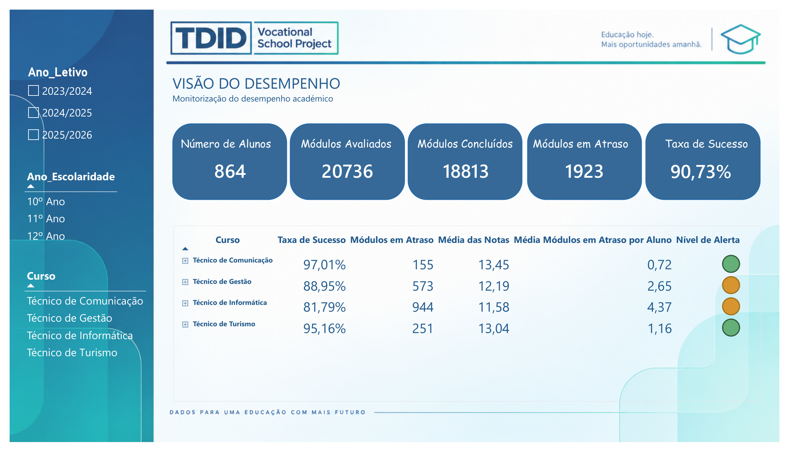
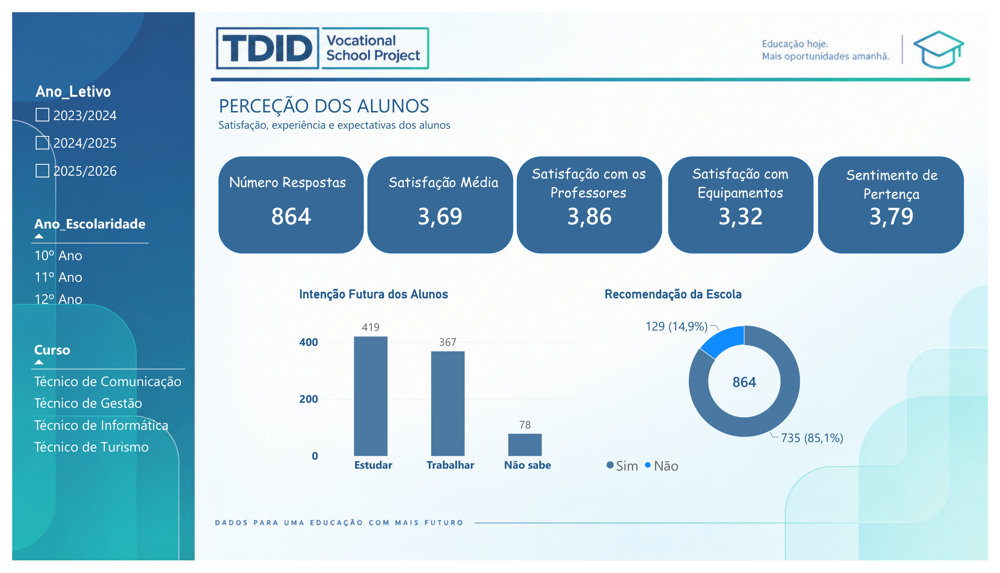
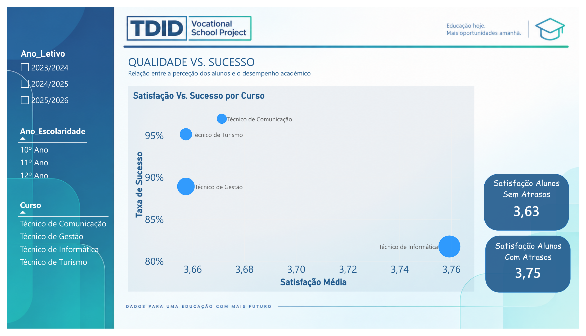
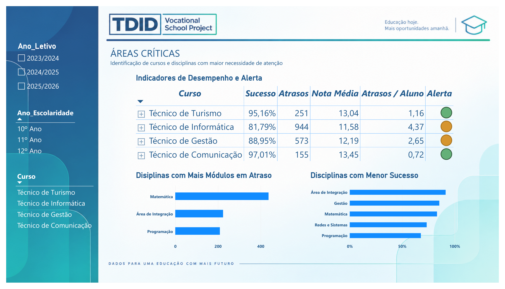
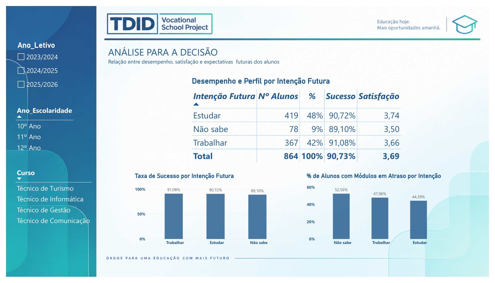
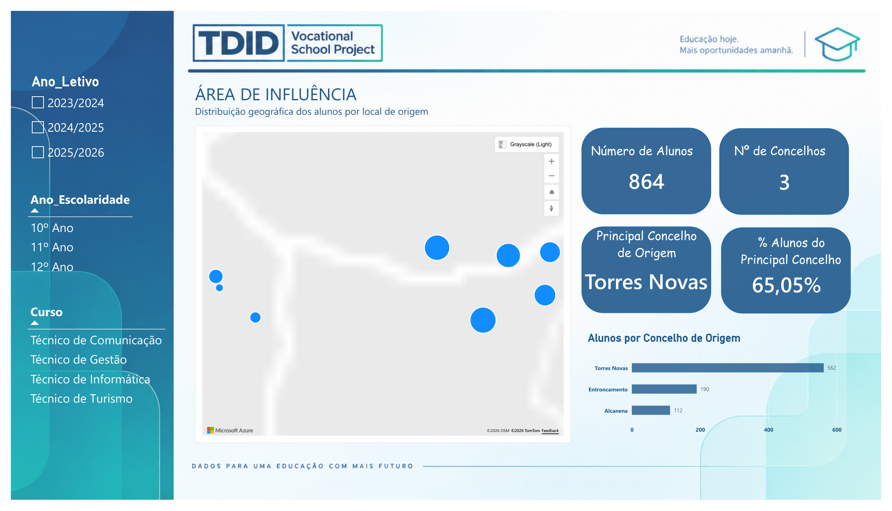
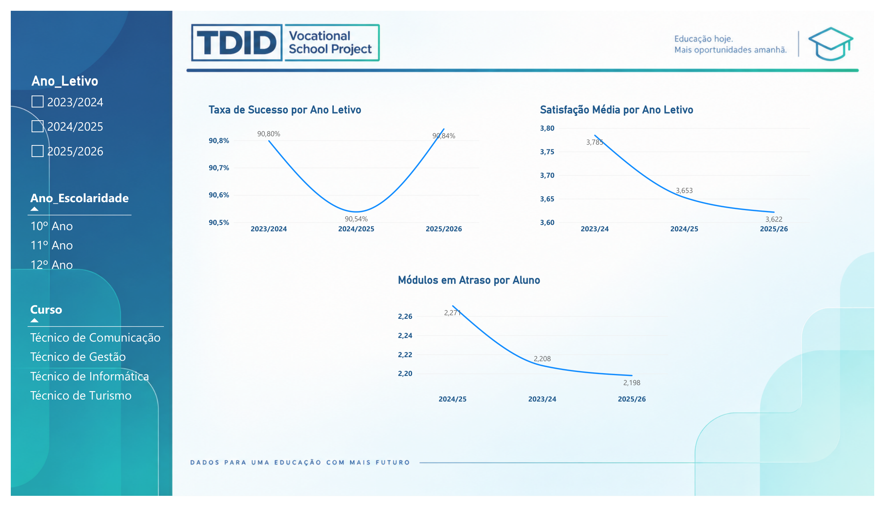

# TDID – Vocational School Project


> **Sistema de Monitorização da Qualidade Escolar**

---

## 📌 Project Overview

**TDID – Vocational School Project** is a portfolio project developed to demonstrate how **Business Intelligence and Data Analytics** can be applied to the monitoring of educational quality and academic performance.

The project illustrates how information from different school processes can be **organised, related and transformed into indicators, analyses and decision-support information** through an interactive Power BI solution.

The objective is not simply to present a collection of charts, but to demonstrate an analytical workflow:

**Data → Data Preparation → Data Model → DAX Measures → Analysis → Decision Support → Monitoring**

> **Note:** all data used in this demonstration is **simulated** and exists exclusively for portfolio and demonstration purposes.

---

## 🎯 Business Context

Educational institutions manage information across multiple areas, including:

- student enrolments;
- academic evaluations;
- courses and disciplines;
- student satisfaction;
- future intentions;
- geographic origin;
- academic performance over time.

When these sources are analysed separately, it can be difficult to obtain an integrated view of educational performance and quality.

This project demonstrates how those different dimensions can be brought together into a single analytical environment.

---

## 💡 Project Objectives

The solution was designed to demonstrate how a school could monitor questions such as:

- How is academic success evolving?
- Which courses or disciplines present higher levels of academic delay?
- How do students perceive their educational experience?
- Is there a relationship between student satisfaction and academic success?
- Which areas require closer monitoring?
- What are students' future intentions?
- Where do students come from geographically?
- How are the main indicators evolving across academic years?

---

## 📊 Power BI Report

The report contains **7 analytical pages**, each focused on a different aspect of educational quality and performance.

### 01 — Visão do Desempenho

> Monitorização do desempenho académico de alunos, cursos, anos e disciplinas.

The page combines academic KPIs with course-level and discipline-level analysis, including success rates, modules evaluated, completed modules and modules in delay.



---

### 02 — Perceção dos Alunos

> Análise da satisfação, experiência e expectativas dos alunos.

The page explores satisfaction, perception of teachers and equipment, sense of belonging, recommendation of the school and future intentions.



---

### 03 — Qualidade vs. Sucesso

> Relação entre a perceção dos alunos e o desempenho académico.

The analysis explores the relationship between student satisfaction and academic success, providing a different perspective on educational quality.



---

### 04 — Áreas Críticas

> Identificação de cursos e disciplinas que requerem maior atenção.

The page supports the identification of areas with lower success rates and higher levels of academic delay, helping to focus further analysis.



---

### 05 — Análise para a Decisão

> Cruzamento entre desempenho, satisfação e expectativas futuras dos alunos.

The analysis connects future intentions with academic performance, satisfaction and modules in delay, demonstrating how different dimensions can be combined to support decision-making.



---

### 06 — Área de Influência

> Análise da distribuição geográfica dos alunos.

The page shows the geographical origin of students and the relative contribution of the main municipalities, providing an overview of the school's area of influence.



---

### 07 — Evolução e Tendências

> Monitorização da evolução dos principais indicadores ao longo dos anos letivos.

The page follows academic success, student satisfaction and modules in delay across academic years.



---

## 📈 Key Indicators

The report demonstrates indicators including:

| Area | Examples |
|---|---|
| Academic Performance | Taxa de Sucesso, Média das Notas |
| Academic Progress | Módulos Concluídos, Módulos em Atraso |
| Student Experience | Satisfação Média, Satisfação com Professores |
| Student Experience | Satisfação com Equipamentos, Sentimento de Pertença |
| Future Intentions | Estudar, Trabalhar, Não sabe |
| Quality Monitoring | Áreas Críticas, Alertas |
| Geography | Concelho de Origem, Área de Influência |
| Evolution | Indicadores por Ano Letivo |

---

## 🗂️ Data Model

The project follows a dimensional modelling approach with dedicated dimension, fact and measures tables.

### Main tables

- `dAluno`
- `dMatricula`
- `dDisciplina`
- `dCurso`
- `dCalendario`
- `fAvaliacao`
- `fQuestionario`
- `_Medidas`

The model connects academic evaluations and questionnaires with student, enrolment, course, discipline and calendar dimensions, allowing the report to respond dynamically to filters and analytical context.

---

## 🔍 Analytical Approach

The project follows a structured data analytics workflow.

### 1. Data Preparation

Data preparation was performed using **Power Query**, including:

- data type correction;
- standardisation of academic-year fields;
- preparation of dimension and fact tables;
- creation of the calendar dimension;
- creation and validation of relationships between academic and questionnaire data.

### 2. Data Modelling

A dimensional model was created using:

- dimension tables;
- fact tables;
- one-to-many relationships;
- a dedicated calendar;
- a dedicated measures table;
- filter-context propagation across the model.

### 3. DAX

DAX measures were created for:

- academic success;
- modules evaluated, completed and in delay;
- average grades;
- student satisfaction;
- recommendation;
- future intentions;
- quality vs. success analysis;
- alerts and critical areas;
- temporal evolution.

### 4. Dashboard Design

The report was designed around:

- consistent navigation;
- synchronized filters;
- KPI cards;
- matrices;
- comparative charts;
- analytical tooltips;
- conditional formatting;
- geographical analysis;
- analytical storytelling.

---

## 🛠️ Tools & Technologies

### Data & ETL
- Microsoft Excel
- Power Query / M

### Data Visualisation
- Microsoft Power BI

### Analytics
- DAX
- Dimensional Data Modelling
- Business Intelligence
- Data Analytics

### Development Approach
- Simulated data
- Business-oriented KPI design
- Interactive dashboard development
- Analytical storytelling

---

## 📂 Project Files

- [Power BI Report PDF](Documentation/TDID_Vocational_School_Report.pdf)
- [Screenshots](Screenshots/)
- [Power BI folder](Power%20BI/)
- [Data folder](Data/)

The Power BI Desktop `.pbix` file can be added to the `Power BI/` folder.

---

## 📦 Data & Scope

The data used in this project is **simulated** and intended exclusively for portfolio and demonstration purposes.

No real student-level information is intended to be published in this repository.

This makes the project suitable for demonstrating the analytical methodology without exposing real educational records.

---

## 🚀 Potential Development

The solution could evolve into a broader school quality monitoring system integrating additional sources and indicators, such as:

- attendance;
- dropout and retention;
- employability;
- progression to further studies;
- student and company satisfaction;
- work-based learning;
- course demand;
- other indicators relevant to educational quality and certification.

The same analytical architecture could progressively incorporate new data sources while maintaining a consistent monitoring framework.

---

## 🧠 Portfolio Positioning

This project demonstrates more than dashboard development.

It combines:

**Business Understanding → Data Preparation → Data Modelling → DAX → Analysis → Decision Support**

It is relevant to work involving:

- Data Analysis
- Business Intelligence
- Power BI
- Education Analytics
- Quality Monitoring
- Data Science

---

## 📁 Repository Structure

```text
TDID-Vocational-School-Project/
│
├── README.md
├── GITHUB_SETUP.md
│
├── Power BI/
│   ├── README.md
│   └── TDID_Vocational_School.pbix
│
├── Documentation/
│   ├── README.md
│   └── TDID_Vocational_School_Report.pdf
│
├── Screenshots/
│   ├── 00_cover.png
│   ├── 01_visao_desempenho.png
│   ├── 02_percecao_alunos.png
│   ├── 03_qualidade_vs_sucesso.png
│   ├── 04_areas_criticas.png
│   ├── 05_analise_decisao.png
│   ├── 06_area_influencia.png
│   └── 07_evolucao_tendencias.png
│
├── Data/
│   └── README.md
│
└── assets/
    └── TDID_Vocational_School_Project_Logo.png
```

---

## 👤 About TDID

**TDID — Turning Data Into Decisions**

The project is part of a portfolio focused on transforming business data into clear information, analytical insights and decision-support tools.

### Author

**Hugo Pires**

Data Analytics | Business Intelligence | Power BI | Python | Machine Learning

---

## 📌 Project Status

**Portfolio Demonstration — Power BI Report Completed**

Current repository components:

- [x] Data model
- [x] DAX measures
- [x] 7-page Power BI report
- [x] Analytical screenshots
- [x] Report PDF
- [x] Simulated data
- [ ] Power BI Desktop (.pbix) file
